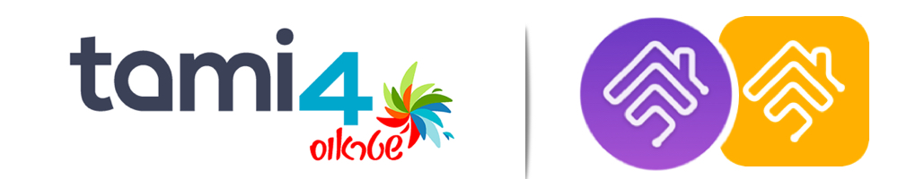

# homebridge-tami4

[](https://www.npmjs.com/package/homebridge-tami4)
[](https://www.npmjs.com/package/homebridge-tami4)

[Homebridge](https://github.com/nfarina/homebridge) plugin for Tami4 Edge+ device (Water Purifier).


### Requirements

 &nbsp;
 &nbsp;


check with: `node -v` & `homebridge -V` and update if needed

# Installation

This plugin  can be easily installed and configured through Homebridge/Hoobs UI.

**To use this plugin you must provide initial ** `refreshToken` ** which can be obtain ~~in 2 different ways~~ only through homebridge UI:

1. Using Homebridge config UI version, you can obtain `refreshToken` easily through the plugin settings and fill all the needed configuration.

~~2. After installing the plugin, open the terminal and run the command: `tami4-extract`. follow the instructions to get the token & imei.~~

\* All methods require to have your phone (the one that was signed in to Tami4 Edge app)

---------

1. Install homebridge using: `sudo npm install -g homebridge --unsafe-perm`
2. Install this plugin using: `sudo npm install -g homebridge-tami4`
3. ~~Run the command `tami4-extract` in terminal and follow instructions to extract token and imei.~~
4. Update your configuration file. See `config-sample.json` in this repository for a sample.

\* install from git: `sudo npm install -g git+https://github.com/nitaybz/homebridge-tami4.git`

## Config file

``` json
"platforms": [
    {
      "platform": "Tami4",
      "refreshToken": "XXX",
      "lighting": true,
      "pushAndDrink": false,
      "nightMode": false,
      "energySaveMode": false,
      "smartHeatingMode": false,
      "buttonsSound": false,
      "statePollingInterval": 300,
      "debug": true,
    }
]
```

### HomeKit Features

All Features in HomeKit are identical (in the name of the switch as well) to the capabilities of Tami4 Edge app. if you don't understand one of the features, use your Tami4 Edge device manual to read more about that capability.

### Issues & Debug

#### I can't control the device, it always goes to previous state

Check the internet connection and that you can control the device from Tami4 Edge app.
If that doesn't help, turn on debug logs in the plugin settings and look for errors.

#### others

If you experience any issues with the plugins please refer to the [Issues](https://github.com/nitaybz/homebridge-tami4/issues) tab and check if your issue is already described there, if it doesn't, please create a new issue with as much detailed information as you can give (logs are crucial).<br>

if you want to even speed up the process, you can add `"debug": true` to your config, which will give me more details on the logs and speed up fixing the issue.

-------------------------------------------


## Credits

Much of the credit belongs to [@leo212](https://github.com/leo212) for his first implementation and integration with the Tami4 Edge devices in his [Smarthings plugin](https://github.com/leo212/tami4edge-smarthings-unofficial)
## Support homebridge-tami4

**homebridge-tami4** is a free plugin under the GNU license. it was developed as a contribution to the homebridge/hoobs community with lots of love and thoughts.
Creating and maintaining Homebridge plugins consume a lot of time and effort and if you would like to share your appreciation, feel free to "Star" or donate. 

<a target="blank" href="https://www.paypal.me/nitaybz"></a><br>
<a target="blank" href="https://www.patreon.com/nitaybz"></a><br>
<a target="blank" href="https://ko-fi.com/nitaybz"></a>